# Shunt — Design Audit & Handoff

**As of:** 2026-04-27 · build 0.3.4 / 52
**Purpose:** Complete inventory of every screen, component, state, copy string, and interaction in the Shunt app, with code references, for design review and redesign work.

For aesthetic principles (Precision Utility, fonts, color philosophy), see `DESIGN.md` — this doc inventories what exists; `DESIGN.md` is the source of truth for what *should* exist.

---

## App at a glance

Shunt is a **menu-bar-only** macOS app (`LSUIElement = true`, no Dock icon, no main window). The entire interactive surface is:

1. The **menu-bar dropdown** (clicked from the status icon, top-right of macOS menu bar).
2. The **Settings window** opened from the dropdown — sidebar layout with 7 tabs.
3. **Sheets** that slide over the Settings window (currently only Launcher Entry Editor).
4. **System alerts** (`NSAlert`) for critical confirmations (e.g. "Add helper bundles?").

The Settings window is a **fixed 820×520 pt** layout (with title bar: 820×552). Not resizable. Not full-screen. Single-window — only one Settings window exists at a time.

Reference: `Sources/Shunt/Views/SettingsView.swift:11`

---

## 1. Window structure

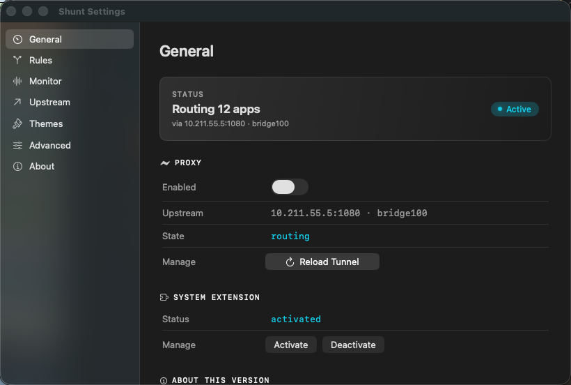

**Layout:** plain `HStack`, not `NavigationSplitView` (a deliberate workaround — `NavigationSplitView` hosted inside the custom `NSWindow` we need for `LSUIElement=true` renders an empty shell).

```
┌─────────────────────────────────────────────────────┐
│ ●●●  Shunt Settings                                 │ ← 28 pt title bar (system)
├──────────┬──────────────────────────────────────────┤
│  General │                                          │
│  Rules   │                                          │
│  Monitor │            DETAIL VIEW                   │
│  Upstream│         (current tab)                    │
│  Themes  │                                          │
│  Advanced│                                          │
│  About   │                                          │
└──────────┴──────────────────────────────────────────┘
  200 pt              620 pt
  sidebar             detail
```

### Sidebar (`SettingsView.swift:35-50`)

- **Width:** fixed 200 pt
- **Background:** `NSVisualEffectView` material `.sidebar` — translucent, picks up wallpaper
- **Items:** 7 entries (`SidebarItem` enum, `:124-152`)
- **Each row:**
  - Icon: SF Symbol, 14 pt, regular weight, 18 pt frame
  - Label: SF Pro 13 pt, regular
  - Padding: 8 pt horizontal, 6 pt vertical
  - Hit area: full row width
- **States:**
  - **Idle:** transparent background, label primary 0.8 opacity, icon primary 0.8
  - **Hover:** primary 0.06 opacity background, 6 pt rounded corners
  - **Selected:** accent at 0.15 opacity background, label and icon accent-tinted
- **Order:** General → Rules → Monitor → Upstream → Themes → Advanced → About
- **No keyboard shortcuts wired** to sidebar items currently (TODO: ⌘1–⌘7?)

### Sidebar item icons (`SettingsView.swift:141-151`)

| Item | SF Symbol |
|---|---|
| General | `gauge.with.needle` |
| Rules | `arrow.triangle.branch` |
| Monitor | `waveform` |
| Upstream | `arrow.up.right` |
| Themes | `paintbrush` |
| Advanced | `slider.horizontal.3` |
| About | `info.circle` |

### Title bar

Standard macOS traffic-light buttons. Title text "Shunt Settings". No toolbar.

---

## 2. General tab


**Source:** `Sources/Shunt/Views/GeneralTab.swift`

**Purpose:** Top-level dashboard. Single screen showing whether the proxy is on, what it's routing through, and the system extension state.

### Anatomy

1. **Page title** — "General", `.shuntTitle1` (22 pt semibold)
2. **StatusCard** (`Components.swift:111`) — the big rounded card at the top
   - Label "STATUS" small caps, accent-colored
   - Title (large): contextual — `Routing N apps` / `Starting…` / `Connecting…` / `Proxy idle` / `Extension not installed`
   - Detail (smaller): contextual — `via 10.211.55.5:1080 · bridge100` / `bringing up prerequisites` / `no traffic is being routed`
   - Pill on the right: **`● Active`** when routing — green dot + label, status-active tint
3. **Section: PROXY** — `SectionHeader` with `bolt.horizontal.fill` icon, tooltip
4. **FormRow Enabled** — `Toggle` switch, accent-tinted
5. **FormRow Upstream** — `MonoText` showing `host:port · bindInterface` (SF Mono with tabular-nums)
6. **FormRow State** — `MonoText` of polled NEVPNStatus: `not configured / disconnected / connecting / routing / reconnecting / disconnecting / unknown`
7. **FormRow Prerequisites** *(conditional)* — only shown when launcher has stages: `N/M ready` + spinner if busy
8. **FormRow Manage** — Reload Tunnel button (see button states below)
9. **Section: SYSTEM EXTENSION** — `puzzlepiece.extension` icon
10. **FormRow Status** — `activated` / `not installed`
11. **FormRow (no label) Manage** — `[Activate]` `[Deactivate]` plain buttons
12. **Section: ABOUT THIS VERSION** — `info.circle` icon
13. **FormRow Version** — `0.3.4 · build 52`
14. **Footnote** at very bottom, `.shuntCaption`, tertiary color: *"Rule changes apply live via the Apply button on the Rules tab. Use Reload Tunnel for a full tunnel restart without stopping launcher dependencies."*

### Reload Tunnel button — 4 states (`GeneralTab.swift:282-313`)

The button **morphs** through label + tint:

| State | Label | Tint | Trigger |
|---|---|---|---|
| Idle | `↻ Reload Tunnel` | accent | default |
| Reloading | `⟳ Reloading…` (spinner) | accent | user click; held min 600 ms |
| OK | `✓ Reloaded` | statusActive (green) | success; 3 s then back to idle |
| Error | `⚠ Failed` | orange | error; 3 s then back to idle |

Animation: 180 ms easeInOut between states.
**External error msg** appears as caption text next to the button when state is `.error`, with the full error in a `.help()` tooltip.

### Conditional banners

- **Launcher failed banner** — orange tinted card, shown when `lastLauncherError` is non-nil (e.g. "Launcher failed: timeout after 120s; last probe: direct==proxied"). Has a "Dismiss" button. Source: `GeneralTab.swift:113-128`.

### Known design issues

- The **Enabled toggle** can desync visually from `State`: if the user just toggled off but the launcher is still tearing down, you can see "Enabled OFF + State: routing" simultaneously. (Visible in screenshot — toggle off, state still routing.)
- The **About this version** section ends abruptly without padding before the footnote. Consider increasing bottom spacing or moving footnote inline.
- The Manage row for the system extension uses **bordered** style buttons while Reload Tunnel uses **borderedProminent** — visual hierarchy is inverted (destructive/heavy actions on top look lighter).

---

## 3. Rules tab

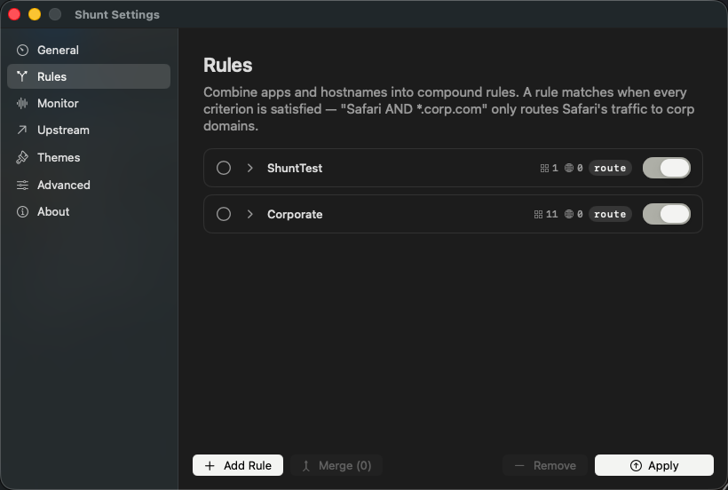
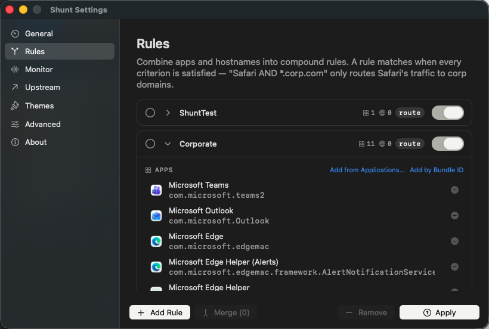

**Source:** `Sources/Shunt/Views/RulesTab.swift` (~710 lines, the largest view file)

**Purpose:** Define **compound rules** — the matching primitives Shunt uses. A rule says: "for these apps going to these hostnames, do action X." Replaces the v0.1 flat "managed apps" list.

### Anatomy

1. **Page title + subtitle** — `Rules` + explanation: *"Combine apps and hostnames into compound rules. A rule matches when every criterion is satisfied — \"Safari AND \*.corp.com\" only routes Safari's traffic to corp domains."*
2. **Scrollable list of rule cards**
3. **Action bar at bottom** — `+ Add Rule`, `↗ Merge (N)`, `− Remove`, `↑ Apply`

### Rule card — collapsed (`RulesTab.swift:202-352` for `RuleCard`)

```
┌───────────────────────────────────────────────────────────────┐
│ ◯  ›  ShuntTest                       ▦ 1   🌐 0   route  ⬤   │
└───────────────────────────────────────────────────────────────┘
```

- **Selection circle** (◯/⦿) on the left — multi-select for Merge/Remove
- **Disclosure chevron** (›/v) — expand/collapse
- **Rule name** — editable inline on click; SF Pro 13 pt medium
- **Counters** — `▦ N` apps, `🌐 N` hosts (small caps mono)
- **Action pill** — `route` (accent color) or `direct` (gray)
- **Enabled toggle** — accent-tinted Switch

### Rule card — expanded body (`RulesTab.swift:355-650`)

Shows two sub-sections:

**APPS** (bundle identifiers + Display Name + icon)
- Section label + two action links: `Add from Applications…` / `Add by Bundle ID`
- Each app row:
  - 32×32 app icon (loaded via `NSWorkspace.icon(forFile:)`)
  - Display name (13 pt regular)
  - Bundle ID below (mono, 11 pt, tabular)
  - `−` remove button on the right
  - **State: missing path** — if the bundle isn't installed locally, show a "?" badge and "Resolve" link to enrich
- Empty state: muted text *"Add apps so any of their flows match this rule. Empty = match any app."*

**HOSTS** (hostname patterns)
- Each row: pattern kind dropdown (`Exact` / `Suffix` / `Glob` / `Regex` / `CIDR`) + value text field + `−` remove
- `+ Add host` button at the bottom
- Empty state: *"Add hostname patterns. Empty = match any host."*

### Action bar (bottom, fixed)

| Button | Style | Disabled when | Notes |
|---|---|---|---|
| `+ Add Rule` | borderedProminent (accent) | never | scrolls to new rule, expands it |
| `Merge (N)` | bordered | < 2 selected | combines selected rules into one |
| `− Remove` | bordered destructive | nothing selected | hard delete |
| `↑ Apply` | borderedProminent | applying | morphs through 4 states (idle/applying/ok/error) — same as GeneralTab Reload, see below |

### Apply button — 4 states (`RulesTab.swift:151-203`)

Identical morph pattern as Reload Tunnel:

| State | Label | Tint |
|---|---|---|
| Idle | `↑ Apply` | accent |
| Applying | `⟳ Applying…` | accent |
| OK | `✓ Applied` | statusActive |
| Error | `⚠ Failed` (msg next to it) | orange |

Min hold 600 ms in applying, 3 s in result. **The Apply button pushes settings to the running provider via `NETunnelProviderSession.sendProviderMessage`** — no tunnel cycle, no launcher disruption.

### Empty state

When `rules` is empty: `EmptyRulesState` view shown — muted text + plus icon + CTA. Captured screenshot pending.

### Known design issues

- The Add Rule / Merge / Remove / Apply action bar has **mixed semantics** — first three modify the local list, Apply pushes to the kernel. Visually they're all in one row. Consider grouping or separating Apply.
- **No filter / search** for rules — gets unwieldy past ~5 rules.
- The disclosure chevron is a tiny hit target. Consider widening to the whole row left of the name.
- Apps with very long bundle IDs (e.g. `com.microsoft.edgemac.framework.AlertNotificationService`) overflow horizontally — currently truncates with `…` mid-string.

---

## 4. Monitor tab

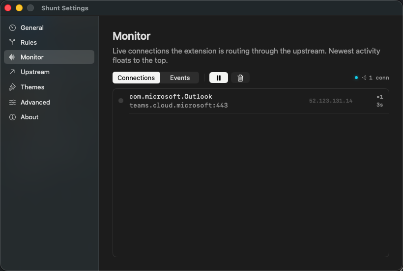

**Source:** `Sources/Shunt/Views/MonitorTab.swift`

**Purpose:** Live view of flows the extension is currently routing or has just routed through the upstream. Reads the `os_log` stream from `subsystem == "com.craraque.shunt.proxy"` and parses `CLAIM` / `SKIP` / `bridge.start` / `socks connected` lines.

### Anatomy

1. **Page title + subtitle** — `Monitor` + *"Live connections the extension is routing through the upstream. Newest activity floats to the top."*
2. **Toolbar:**
   - Segmented `Connections` / `Events` — switches between connections (live) and events (rolling log)
   - `▌▌` Pause button — stops appending new entries
   - `🗑️` Clear button — wipes the visible buffer
   - On the right: `● 1 conn` — connection count + active LED
3. **Connection list** — newest at top
   - Each row: `bundle.id` (mono small), hostname:port (mono), egress IP, `×N` retries, `Ns` age
   - Hover or click for more detail (TODO: not yet implemented)

### Empty state

When nothing is being routed: *"No live connections. Generate traffic from a routed app and it will appear here."*

### Known design issues

- The **Events** segment isn't yet implemented — switching to it shows nothing useful. Either implement or hide.
- The **× retries** counter convention is unclear — designer should confirm whether `×1` means "1 attempt total" or "1 retry on top of the original".
- Pause and Clear are icon-only; tooltip on hover, but the default state of Pause (▌▌) vs Resume (▶) isn't very discoverable.
- No filter/search by app or host.

---

## 5. Upstream tab

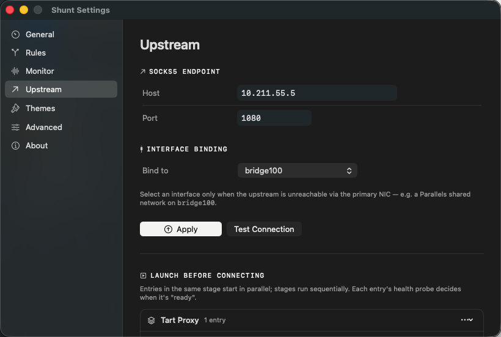
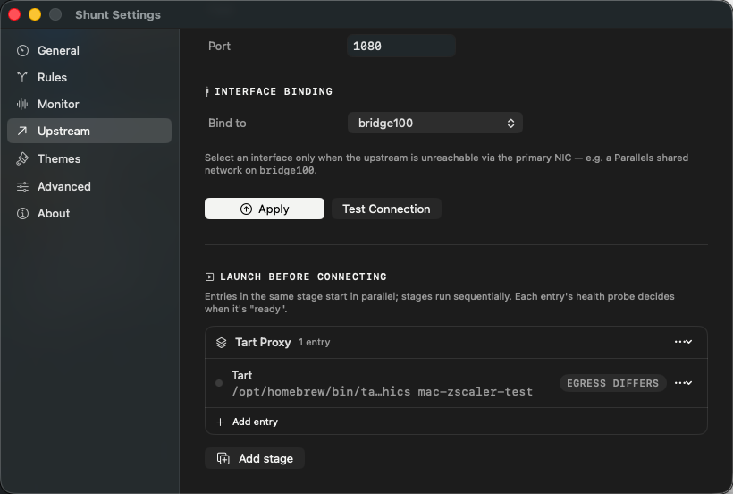

**Source:** `Sources/Shunt/Views/UpstreamTab.swift` + `Sources/Shunt/Views/UpstreamLauncherSection.swift`

**Purpose:** Where the routed traffic goes — SOCKS5 host/port, optional NIC binding, and "launch before connecting" prerequisites (VMs, SSH tunnels, anything Shunt should bring up before the proxy itself is enabled).

### Anatomy

1. **Page title** — `Upstream`
2. **Section: SOCKS5 ENDPOINT** — `arrow.up.right` icon
   - FormRow `Host` — text field, mono, 260 pt wide, placeholder `10.211.55.5`
   - FormRow `Port` — text field, mono, 120 pt wide, placeholder `1080`
3. **Section: INTERFACE BINDING** — `cable.connector` icon
   - FormRow `Bind to` — Picker dropdown (None / list of interfaces from `getifaddrs`)
   - Helper caption: *"Select an interface only when the upstream is unreachable via the primary NIC — e.g. a Parallels shared network on `bridge100`."*
4. **Action row:**
   - `↑ Apply` button (borderedProminent, accent, ⌘↩ keyboard shortcut) — same 4-state morph as Rules/Reload
   - `Test Connection` button (bordered) — fires off a SOCKS5 handshake test, result appears below as `OK 240ms` (green check) or error (warning icon)
5. **Divider**
6. **Section: LAUNCH BEFORE CONNECTING** — `square.stack` icon
   - Caption: *"Entries in the same stage start in parallel; stages run sequentially. Each entry's health probe decides when it's \"ready\"."*
   - List of stages, each is a card containing N entries
   - `+ Add stage` button at the bottom

### Stage card (collapsed)

```
┌───────────────────────────────────────────┐
│ ⊠ Tart Proxy   1 entry                ⋯ ⌄ │
└───────────────────────────────────────────┘
```

- Drag handle on far left (reorder stages)
- Stage name + entry count
- `⋯` menu: rename / duplicate / delete
- `⌄` chevron expand/collapse

### Stage card (expanded)

Each entry shown as a row:

```
│ ◯  Tart                                                          │
│    /opt/homebrew/bin/ta…hics mac-zscaler-test  EGRESS DIFFERS  ⋯ │
│  + Add entry                                                     │
```

- Status dot — gray (idle), animated spinner (starting), green (running), red (failed)
- Entry name
- Truncated start command (mono)
- **Probe pill** — small caps badge: `EGRESS DIFFERS` / `EGRESS CIDR` / `SOCKS5` / `TCP PORT`
- `⋯` menu: Edit / Disable / Duplicate / Remove

### Known design issues

- **`Apply` and `Test Connection` are visually competing** — both sized similarly. Hierarchy is wrong; Apply should be heavier.
- The **truncated command** uses `…` mid-string which can hide the action verb (e.g. `ta…hics` hides the `tart run --no-graphics` part). Tooltip with full command is missing.
- **No way to see live launcher state from this tab** — you have to go to General → Status card to see "N/M ready". Consider adding inline progress.
- The "EGRESS DIFFERS" pill is the same gray for all probe types — they should color-differentiate (e.g. CIDR yellow, SOCKS5 purple, TCP green) so the type is glanceable.

---

## 6. Themes tab

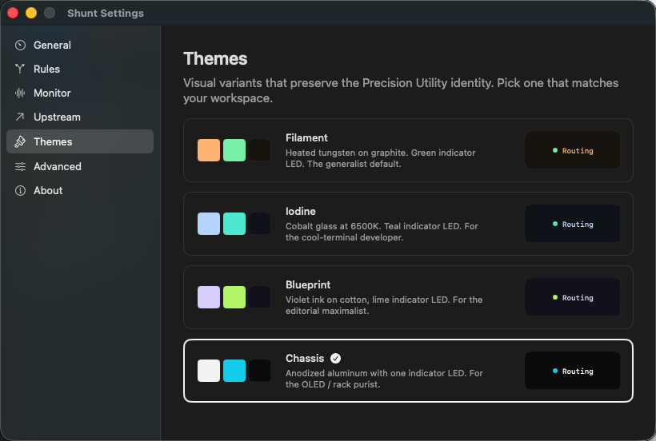

**Source:** `Sources/Shunt/Views/ThemesTab.swift`, `Sources/Shunt/DesignSystem/Theme.swift`

**Purpose:** Visual variant picker. All themes share Precision Utility identity — only colors change.

### Anatomy

- Page title `Themes` + caption *"Visual variants that preserve the Precision Utility identity. Pick one that matches your workspace."*
- 4 cards, each with:
  - 3 color swatches (~32×32) showing accent / status-active / window-background
  - Name + description
  - Mini preview pill: `● Routing` rendered with that theme's tint
  - Click anywhere to select — selected card has 2 pt accent border + checkmark

### Themes inventory

| # | Name | Accent (light/dark) | Status-active (light/dark) | Description |
|---|---|---|---|---|
| 1 | **Filament** | `#EA580C` / `#FDBA74` | `#22C55E` / `#86EFAC` | Heated tungsten on graphite. Green indicator LED. The generalist default. |
| 2 | **Iodine** | `#2563EB` / `#BFDBFE` | `#14B8A6` / `#5EEAD4` | Cobalt glass at 6500K. Teal indicator LED. For the cool-terminal developer. |
| 3 | **Blueprint** | `#7C3AED` / `#DDD6FE` | `#84CC16` / `#BEF264` | Violet ink on cotton, lime indicator LED. For the editorial maximalist. |
| 4 | **Chassis** | `#0A0A0A` / `#F5F5F4` | `#0891B2` / `#22D3EE` | Anodized aluminum with one indicator LED. For the OLED / rack purist. |

### Known design issues

- The 4 cards are **same height** even though descriptions vary in length — works but can feel stretched.
- The "Routing" preview pill uses the theme's status-active color but says "Routing" in English — won't translate cleanly to Spanish. Consider using just `●` plus a value.
- No **light/dark preview** — user must switch macOS appearance to see how the theme looks the other way.

---

## 7. Advanced tab

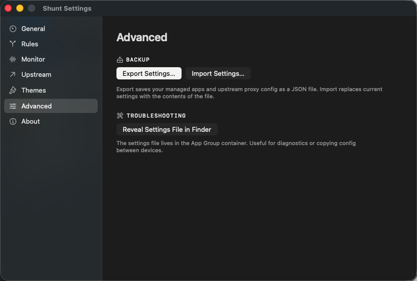

**Source:** `Sources/Shunt/Views/AdvancedTab.swift`

**Purpose:** Power-user actions that don't fit elsewhere. Currently minimal.

### Anatomy

1. Page title `Advanced`
2. **Section: BACKUP** — `arrow.down.doc` icon
   - `Export Settings…` button — opens save panel, writes JSON of full settings
   - `Import Settings…` button — opens open panel, replaces current settings
   - Caption: *"Export saves your managed apps and upstream proxy config as a JSON file. Import replaces current settings with the contents of the file."*
3. **Section: TROUBLESHOOTING** — `wrench.and.screwdriver` icon
   - `Reveal Settings File in Finder` button — opens App Group container
   - Caption: *"The settings file lives in the App Group container. Useful for diagnostics or copying config between devices."*

### Known design issues

- Page is mostly empty space. Could host:
  - A **diagnostics dump** button (compose a tar.gz of logs + settings for support)
  - **Reset to defaults** (currently no way to do this without deleting the file manually)
  - Toggle "Verbose logging"
  - System extension activate / deactivate (currently lives in General tab, arguably belongs here)

---

## 8. About tab

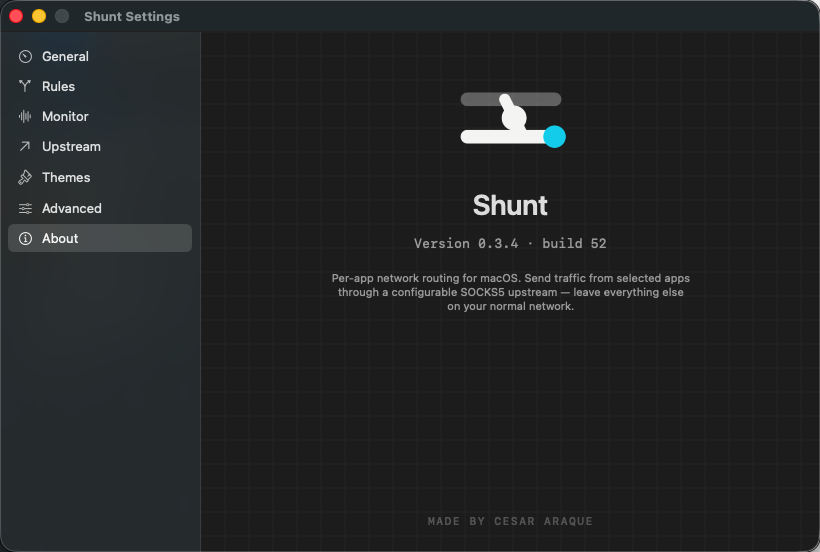

**Source:** `Sources/Shunt/Views/AboutTab.swift`

**Purpose:** Brand + version. Legal copy.

### Anatomy

1. **Logo** centered — the railway icon (custom SVG-derived, accent-tinted)
2. **Wordmark** — `Shunt` in `.shuntTitle1`
3. **Version line** — `Version 0.3.4 · build 52` mono
4. **Tagline** — *"Per-app network routing for macOS. Send traffic from selected apps through a configurable SOCKS5 upstream — leave everything else on your normal network."*
5. **Background** — subtle PCB-style grid pattern (very low opacity)
6. **Footer** — `MADE BY CESAR ARAQUE` small caps, mono, secondary color, centered at bottom

### Known design issues

- No **license / acknowledgements** link — eventually needed for OSS components. (Currently 0 third-party deps so it's fine.)
- No **link to homepage / repo / issue tracker**.

---

## 9. Modal: Launcher Entry Editor

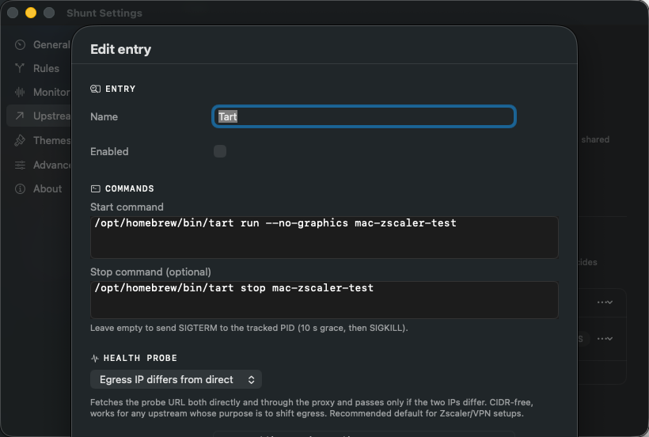
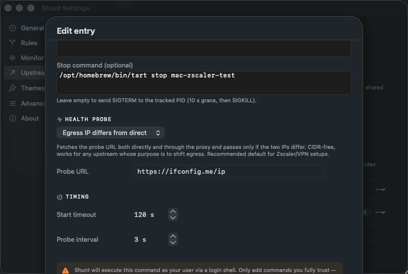

**Source:** `Sources/Shunt/Views/LauncherEntryEditor.swift`

**Trigger:** Upstream tab → stage row → `⋯` menu → Edit (or `+ Add entry` for new).

**Type:** SwiftUI `.sheet()` over the Settings window — same window, modal overlay.

### Anatomy (top to bottom)

1. **Title** — `Edit entry` (or `Add entry`), `.shuntTitle1`
2. **Section: ENTRY** — `gearshape` icon
   - FormRow `Name` — text field, full width
   - FormRow `Enabled` — toggle
3. **Section: COMMANDS** — `terminal` icon
   - Multi-line text field `Start command` — placeholder `/opt/homebrew/bin/tart run mac-vm`
   - Multi-line text field `Stop command (optional)` — placeholder
   - Caption: *"Leave empty to send SIGTERM to the tracked PID (10 s grace, then SIGKILL)."*
4. **Section: HEALTH PROBE** — `sparkles` icon (or similar)
   - Picker dropdown — 4 options:
     - **Port open (TCP)** — `connect()` to upstream host:port
     - **SOCKS5 handshake** — TCP + send `05 01 00`, expect `05 00`
     - **Egress CIDR match** — fetch URL via SOCKS, parse IP body, match against CIDR
     - **Egress IP differs from direct** — fetch URL twice (direct + via SOCKS), pass when IPs differ
   - Contextual caption below the picker explaining the chosen mode
   - Conditional fields:
     - `Probe URL` — text field — visible only for `egressCidrMatch` and `egressDiffersFromDirect`
     - `Expected CIDR` — text field — visible only for `egressCidrMatch`
5. **Section: TIMING** — `clock` icon
   - FormRow `Start timeout` — stepper, default 120 s
   - FormRow `Probe interval` — stepper, default 3 s
6. **Warning banner** (orange tint) — *"Shunt will execute this command as your user via a login shell. Only add commands you fully trust — …"*
7. **Footer:** `Cancel` (bordered) / `Save` (borderedProminent, accent, default action)

### Known design issues

- **The sheet content is taller than the parent window** in some configurations (especially with `egressCidrMatch` showing both probe URL and CIDR fields). Consider either growing the sheet, scrolling internally, or splitting into steps.
- The probe picker labels are technical jargon — designer should review whether to surface user-friendly names ("Just check if the proxy is up" vs "Verify traffic actually changes egress IP").
- The **command text fields** are plain — no syntax highlighting, no `$PATH` resolver, no example dropdown of common commands (`tart`, `prlctl`, `vmrun`, `ssh -D`, `sshuttle`).
- The warning banner appears between Timing and the buttons — easy to miss. Consider promoting to a tinted background for the entire Commands section, or moving above the command fields.

---

## 10. Menu bar dropdown

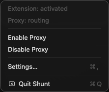

**Source:** `Sources/Shunt/App/AppDelegate.swift:112-145`

**Type:** `NSMenu` attached to `NSStatusItem` — system-rendered, minimal styling control.

**Trigger:** click the Shunt icon in the macOS menu bar (top-right).

### Items (in order)

| Label | State / target | Notes |
|---|---|---|
| `Extension: <state>` | disabled (informational) | dynamically updated: `activated` / `not installed` / `…` |
| `Proxy: <state>` | disabled (informational) | `routing` / `disconnected` / `connecting` / etc. |
| — divider — | | |
| `Enable Proxy` | enabled when not running | calls `proxyManager.enable()` |
| `Disable Proxy` | enabled when running | calls `proxyManager.disable()` |
| — divider — | | |
| `Settings…` | `⌘,` | opens (or focuses) the Settings window |
| — divider — | | |
| `Quit Shunt` | `⌘Q` | terminates app + tunnel |

### Known design issues

- Both `Enable Proxy` and `Disable Proxy` are always shown — could collapse to one dynamic item ("Enable Proxy" when off, "Disable Proxy" when on) for cleaner UX.
- The two top informational items use the same font weight as actions — eye can't quickly separate "status" from "actions".
- No **upstream summary** in the menu (e.g. `→ 10.211.55.5:1080`). Useful at a glance without opening Settings.
- No **icon** on each menu item — could add SF Symbols (`bolt.fill` for Enable, `bolt.slash` for Disable, `gearshape` for Settings, etc.) for visual scanning.
- No **app icon / theme** in the menu bar header — currently just text.

### Menu bar status icon

Custom SF Symbol-based icon:
- **Idle / not configured:** plain railway-shunt glyph, monochrome
- **Routing:** glyph + accent dot indicator
- **Connecting:** glyph + spinner / dashed dot
- **Error:** glyph + small warning badge

Icon source: `Sources/Shunt/DesignSystem/MenubarIcons.swift`

---

## 11. Shared components

### `SectionHeader` (`Components.swift:13-50`)

```
⚡ PROXY ⓘ
```

- Small caps label, accent-tinted, 11 pt mono uppercase
- Optional 10 pt SF Symbol icon, secondary color
- Optional `(?)` icon with `.help()` tooltip on hover

Used in every tab to break content into named groups.

### `StatusCard` (`Components.swift:111-152`)

The big rounded info card at the top of GeneralTab. Single-purpose component — only used there.

- 16 pt vertical padding, 20 pt horizontal
- 12 pt corner radius
- Border: 1 pt stroke, secondary color at 0.4
- Trailing pill: pill-shaped, 8 pt vertical padding, status-active tint when `active == true`

### `FormRow` (`Components.swift:154-178`)

The standard "label-on-left, control-on-right" row used in every settings tab.

- Label: 13 pt, secondary, fixed 140 pt width, left-aligned
- Content slot: trailing, takes remaining width
- Vertical padding: 8 pt
- Divider between consecutive rows is rendered by the parent

### `MonoText` (`Components.swift:179-191`)

SF Mono with `tabular-nums` feature for IPs, ports, bundle IDs. Single argument: optional color override. Default size matches `.shuntMonoData` (12 pt).

### Toggle (`SwiftUI Toggle`)

Used in 3 places: General → Enabled, Rules → per-rule enable, Editor → entry enabled. **All accent-tinted via `.tint(theme.accent(for: scheme))`**. macOS-native switch style.

### Buttons

| Style | When |
|---|---|
| `.borderedProminent` + accent tint | Primary action (Apply, Add Rule, Save) |
| `.bordered` | Secondary (Test Connection, Cancel, Activate, Deactivate) |
| `.bordered` + `.destructive` role | Remove |
| `.plain` (no chrome) | Sidebar rows, link-style (`Add from Applications…`) |

---

## 12. Typography (`DesignSystem/Fonts.swift`)

| Token | Spec | Usage |
|---|---|---|
| `shuntTitle1` | SF Pro 22 pt semibold | Tab titles ("General", "Rules") |
| `shuntTitle2` | SF Pro 17 pt semibold | Sub-section titles (rare) |
| `shuntBody` | SF Pro 15 pt regular | Tab descriptions, body copy |
| `shuntLabel` | SF Pro 13 pt regular | FormRow labels, sidebar, default UI |
| `shuntLabelStrong` | SF Pro 13 pt medium | Emphasized labels (rare) |
| `shuntCaption` | SF Pro 11 pt regular | Helper text, footnotes, error messages |
| `shuntMonoData` | SF Mono 12 pt + tabular-nums | IPs, ports, bundle IDs, paths |
| `shuntMonoLabel` | SF Mono 11 pt uppercase + tabular | Section header labels (e.g. "PROXY") |

**Localization status:** copy is currently English-only. `DESIGN.md` says all user-facing strings should be localizable (English + Spanish) via String Catalog — **not yet implemented**.

---

## 13. Color (`DesignSystem/Theme.swift` + `Colors.swift`)

Each theme defines 4 logical colors × 2 variants (light/dark):

- **accent** — Brand. Used for: primary buttons, sidebar selection, toggle tints, rule action pill (`route`), section header labels
- **statusActive** — "Things are routing". Used for: status pill, "Routing" indicator dots, Apply success state, statusCard's "Active" pill
- **windowBg** — page background of detail view
- **rowHover** — sidebar row hover background, list-item hover

**Plus system colors used directly:**
- `Color(nsColor: .windowBackgroundColor)` — overall window
- `Color(nsColor: .textBackgroundColor)` — rule cards, monitor list rows
- `Color(nsColor: .separatorColor)` — borders, dividers
- `.orange` — error states (hardcoded, NOT theme-driven — by design)
- `.red` — destructive button labels

**Localization of colors:** Theme picks `light` / `dark` based on `colorScheme` env. macOS controls scheme via System Settings → Appearance.

---

## 14. Animations & interactions

The codebase deliberately uses **system transitions only** (no custom curves) per `DESIGN.md`:

- `.easeOut(duration: 0.18)` for rule expand/collapse (`RulesTab.swift:60-64`)
- `.easeOut(duration: 0.20)` for scroll-to-new-rule (`RulesTab.swift:97-99`)
- `.easeInOut(duration: 0.18)` for Apply/Reload button morph
- `.scrollTo(id, anchor: .bottom)` after Add Rule
- `withAnimation` only used in 3 places total — codebase is intentionally restrained

Loading indicators: native `ProgressView()` with `.controlSize(.small)`, often `.colorInvert()` when placed over a tinted button background.

---

## 15. Strings inventory (English copy)

For localization planning. Dump of every user-facing string by tab:

**General:**
- "General"
- "STATUS" / "PROXY" / "SYSTEM EXTENSION" / "ABOUT THIS VERSION"
- "Routing N apps" / "Starting…" / "Starting N/M prereqs…" / "Connecting…" / "Proxy idle" / "Extension not installed"
- "via {host}:{port}" / "bringing up prerequisites" / "no traffic is being routed"
- "Enabled" / "Upstream" / "State" / "Prerequisites" / "Manage" / "Status" / "Version"
- "not configured" / "disconnected" / "connecting" / "routing" / "reconnecting" / "disconnecting" / "unknown"
- "activated" / "not installed"
- "Reload Tunnel" / "Reloading…" / "Reloaded" / "Failed"
- "Activate" / "Deactivate"
- "Launcher failed: {error}" / "Dismiss"
- "Rule changes apply live via the Apply button on the Rules tab. …"

**Rules:**
- "Rules"
- "Combine apps and hostnames into compound rules. A rule matches when every criterion is satisfied — \"Safari AND \*.corp.com\" only routes Safari's traffic to corp domains."
- "APPS" / "HOSTS"
- "Add from Applications…" / "Add by Bundle ID" / "Add host"
- "Add Rule" / "Merge (N)" / "Remove" / "Apply" / "Applying…" / "Applied" / "Failed"
- "Add N helper {bundle/bundles}?" alert + body + "Add Main + Helpers" / "Add Main Only"
- (empty state strings — pending capture)

**Monitor:** "Monitor" / "Live connections the extension is routing through the upstream. Newest activity floats to the top." / "Connections" / "Events" / "N conn"

**Upstream:** "Upstream" / "SOCKS5 ENDPOINT" / "Host" / "Port" / "INTERFACE BINDING" / "Bind to" / "None (use routing table)" / "Apply" / "Test Connection" / "Select an interface only when the upstream is unreachable via the primary NIC — e.g. a Parallels shared network on `bridge100`." / "LAUNCH BEFORE CONNECTING" / "Entries in the same stage start in parallel; stages run sequentially. Each entry's health probe decides when it's \"ready\"." / "Add stage" / "Add entry"

**Themes:** "Themes" / "Visual variants that preserve the Precision Utility identity. Pick one that matches your workspace." / theme names + descriptions (see table § 6)

**Advanced:** "Advanced" / "BACKUP" / "Export Settings…" / "Import Settings…" / "TROUBLESHOOTING" / "Reveal Settings File in Finder" / explanatory captions

**About:** "Shunt" / "Version 0.3.4 · build 52" / "Per-app network routing for macOS. Send traffic from selected apps through a configurable SOCKS5 upstream — leave everything else on your normal network." / "MADE BY CESAR ARAQUE"

**Editor sheet:** "Edit entry" / "Add entry" / "ENTRY" / "Name" / "Enabled" / "COMMANDS" / "Start command" / "Stop command (optional)" / "Leave empty to send SIGTERM to the tracked PID (10 s grace, then SIGKILL)." / "HEALTH PROBE" / "TIMING" / "Start timeout" / "Probe interval" / "Save" / "Cancel" / probe-mode names + per-mode explanations

**Menu bar:** "Extension: {state}" / "Proxy: {state}" / "Enable Proxy" / "Disable Proxy" / "Settings…" / "Quit Shunt"

---

## 16. Open design questions

Issues called out per-section above, consolidated:

1. **Toggle/state desync visible in General tab** — should the State row reflect intent or actual?
2. **Rules action bar mixes local-edit and kernel-push semantics** — consider grouping or separating Apply.
3. **No filter/search in Rules or Monitor** — needed past ~5 items.
4. **Probe pill is single-color regardless of mode** — color-differentiate by probe type for glanceability.
5. **Editor sheet can overflow window** — needs internal scroll OR multi-step OR resizable parent.
6. **Probe-mode picker uses jargon** — consider user-friendly names.
7. **Menu bar dropdown** could collapse Enable/Disable to one dynamic item, add icons, add upstream summary.
8. **About is brand-only** — no repo / issue / license links.
9. **Advanced tab is sparse** — could host diagnostics dump, reset to defaults, verbose logging toggle.
10. **No localization yet** — every string in § 15 needs catalog work.
11. **Empty states** captured only for Apps/Hosts inside rules — capture standalone empty Rules list, empty Monitor, etc. for full handoff.
12. **Themes cards use "Routing" preview pill** — won't translate cleanly.

---

## 17. Code reference index

| Surface | File | Key lines |
|---|---|---|
| Settings window shell | `Sources/Shunt/Views/SettingsView.swift` | full |
| Sidebar item enum | `Sources/Shunt/Views/SettingsView.swift` | 124-152 |
| GeneralTab | `Sources/Shunt/Views/GeneralTab.swift` | full |
| RulesTab | `Sources/Shunt/Views/RulesTab.swift` | full |
| RuleCard component | `Sources/Shunt/Views/RulesTab.swift` | 202-352 |
| MonitorTab | `Sources/Shunt/Views/MonitorTab.swift` | full |
| UpstreamTab | `Sources/Shunt/Views/UpstreamTab.swift` | full |
| Launcher section | `Sources/Shunt/Views/UpstreamLauncherSection.swift` | full |
| Launcher Entry Editor | `Sources/Shunt/Views/LauncherEntryEditor.swift` | full |
| ThemesTab | `Sources/Shunt/Views/ThemesTab.swift` | full |
| AdvancedTab | `Sources/Shunt/Views/AdvancedTab.swift` | full |
| AboutTab | `Sources/Shunt/Views/AboutTab.swift` | full |
| Shared Components | `Sources/Shunt/Views/Components.swift` | full |
| Theme definitions | `Sources/Shunt/DesignSystem/Theme.swift` | full |
| Typography tokens | `Sources/Shunt/DesignSystem/Fonts.swift` | full |
| Menu bar | `Sources/Shunt/App/AppDelegate.swift` | 112-145 |

---

## 18. What's missing from this audit

Captured visually:
- ✅ All 7 tabs (General, Rules, Monitor, Upstream, Themes, Advanced, About)
- ✅ Rule expanded showing apps
- ✅ Upstream with launcher section
- ✅ Launcher Entry Editor sheet (top + middle)
- ✅ Menu bar dropdown
- ⚠ Editor sheet bottom (Save/Cancel) — partially covered
- ❌ Apply button transient states (idle → applying → ok / failed)
- ❌ Reload Tunnel transient states
- ❌ Empty states (Rules empty, Monitor empty, Hosts empty)
- ❌ "Add Main + Helpers" NSAlert (fires on file picker import only)
- ❌ Launcher failed orange banner (requires forcing a launcher failure)
- ❌ Themes — actual switch in flight (is there a transition?)
- ❌ Test Connection result row (success / failure variants)
- ❌ Rule with multiple apps + multiple hosts mixed
- ❌ App enrich "Resolve" link (when bundle missing)
- ❌ Light-mode rendering — every screenshot is dark mode

If the designer wants any of these, run another capture cycle.
